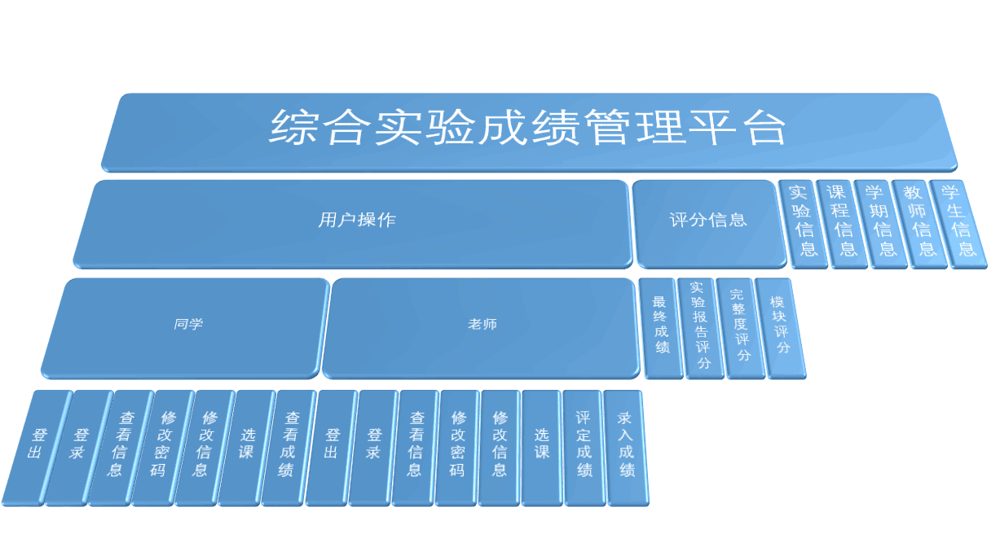
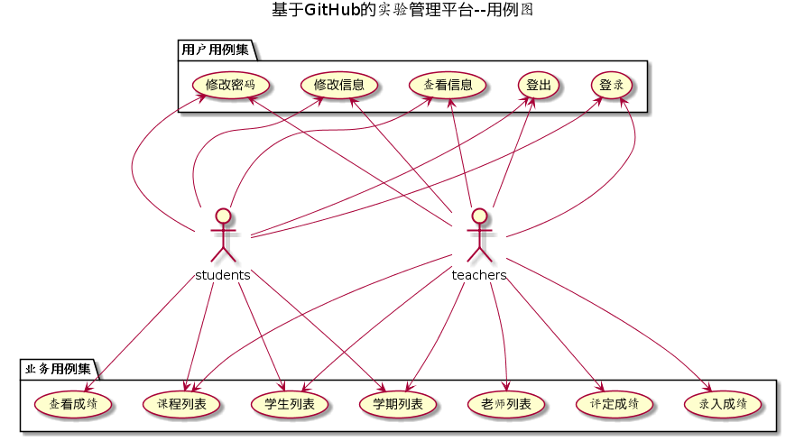
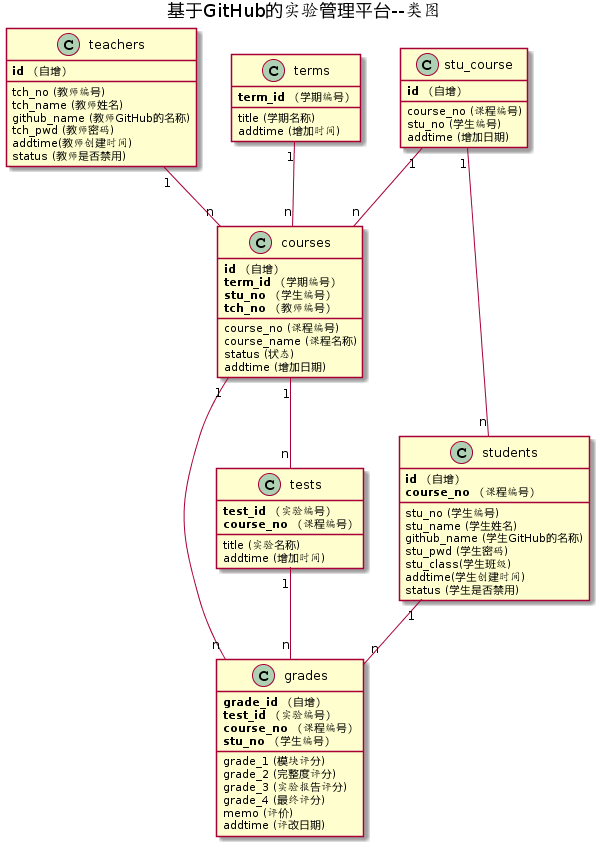

## 1.系统层次结构

## 2.界面设计[https://WangYaDong1.github.com/is_analysis/test6/ui/index.html](https://WangYaDong1.github.com/is_analysis/test6/ui/index.html)

## 3.用例图设计  [源码](./src/系统用例源码.puml)

## 4.类图设计  [源码](./src/系统类图源码.puml)

## 5.数据库设计

##### [点击查看数据库设计](./数据库设计.md)

## 6.用例及界面详细设计

##### [登录用例](./用例/登录用例.md)

##### [登出用例](./用例/登出用例.md)

##### [学生信息用例](./用例/学生信息用例.md)

##### [老师信息用例](./用例/老师信息用例.md)

##### [学期信息用例](./用例/学期信息用例.md)

##### [查看成绩用例](./用例/查看成绩用例.md)

##### [评定成绩用例](./用例/评定成绩用例.md)

##### [修改用户信息用例](./用例/修改用户信息用例.md)

##### [查看用户信息用例](./用例/查看用户信息用例.md)

##### [修改密码用例](./用例/修改密码用例.md)

##### [课程信息用例](./用例/课程信息用例.md)