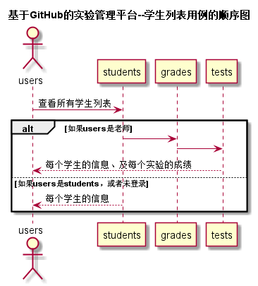

# 学生表-用例 [返回](../README.md)

## 1.用例说明

| 用例名称  |      学生列表       |
| :---: | :-------------: |
|  功能   | 以表形式的显示出所有学生的信息 |
|  参与者  |    游客，学生，老师     |
| 前置条件  |   学生，老师需要先登录    |
| 后置条件  |                 |
| 主事件流  |                 |
| 备选事件流 |                 |

## 2.业务流程

## 3.界面设计

 [https://WangYaDong1.github.com/is_analysis/test6/ui/学生信息页面.html](https://WangYaDong1.github.com/is_analysis/test6/ui/学生信息页面.html)

- 界面
- API接口调用：

	 [ ] 	 接口1:[getStudents](../接口/getStudents.md)

## 4.算法描述

无

## 5.参照表

- [学生信息](../数据库设计.md)
- [学期信息](../数据库设计.md)
- [实验信息](../数据库设计.md)
- [分值信息](../数据库设计.md)

