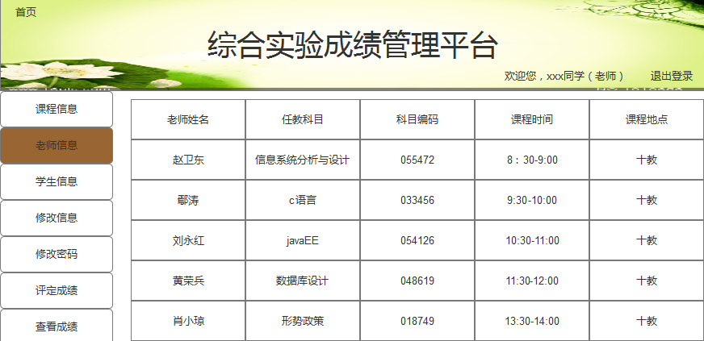

## 查看用户信息-用例 [返回](../README.md)

### 1. 用例规约

用例名称 | 查看用户信息
---|---
功能 | 查看用户的所有信息
参与者 | 学生、老师
前置条件 | 必须先登录
后置条件 | 
主事件流 | 
备选事件流 | 

### 2. 业务流程（顺序图）
无

### 3. 界面设计

- API接口调用
    - 接口1：[getStudentsInfo](../接口/getStudentInfo.md)
    - 接口2：[getTeachersInfo](../接口/getTeacherInfo.md)

### 4. 算法描述
无

### 5. 参照表
- [学生信息](../数据库设计.md)
- [老师信息](../数据库设计.md)
