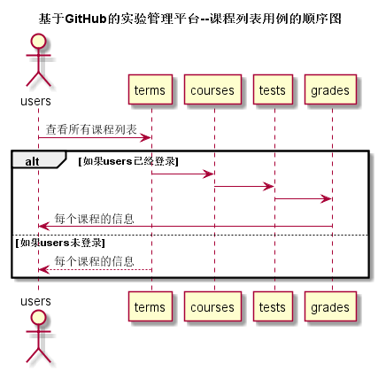

## 课程/实验/评分列表-用例 [返回](../README.md)

### 1. 用例规约

用例名称 | 课程/实验/评分列表
---|---
功能 | 以表形式的显示出所有课程的信息
参与者 | 学生、老师
前置条件 | 学生、老师需要先登录
后置条件 | 
主事件流 | 
备选事件流 | 

### 2. 业务流程（顺序图）

### 3. 界面设计

 [https://WangYaDong1.github.io/is_analysis/test6/ui/课程信息页面.html](https://WangYaDong1.github.io/is_analysis/test6/ui/课程信息页面.html)

- API接口调用
    - 接口1：[getCourses](../接口/getCourses.md)

### 4. 算法描述
无
### 5. 参照表
- [老师信息](../数据库设计.md)
- [课程信息](../数据库设计.md)
- [学期信息](../数据库设计.md)
- [学生信息](../数据库设计.md)
- [分值信息](../数据库设计.md)
- [实验信息](../数据库设计.md)
